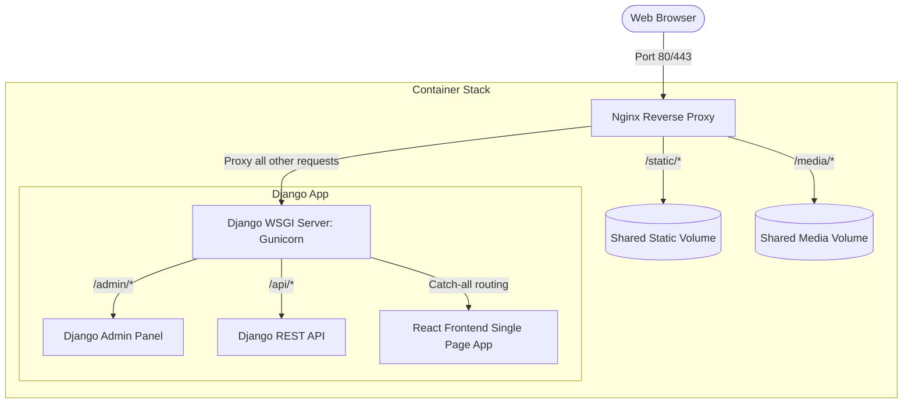

# Inkspire - Production Deployment & Routing Architecture

This monorepo contains the **Inkspire** full-stack application, which integrates a **Vite/React frontend** and a **Django REST Framework backend** into a production-ready, monolithic container stack.

---

## 🏗️ Architecture Overview

The production architecture is designed to run as a single optimized image (or behind Nginx locally) to minimize server resource costs while maintaining clear routing separation.



---

## 🚦 Routing & Django Admin Separation

The separation between the **React Client** and **Django Admin / API** is achieved at the URL routing layer inside Django's `core/urls.py` and fronted by Nginx/WhiteNoise.

### 1. The Route Map
Any incoming request is matched sequentially against the following patterns:

| Route Pattern | Target Destination | Handler |
| :--- | :--- | :--- |
| `/admin/*` | Django Administration Panel | Django's built-in Admin View |
| `/api/*` | Backend REST Endpoints | Django REST Framework Views |
| `/static/*` | Stylesheets, JS modules, Images | Served directly by Nginx (or WhiteNoise) |
| `/media/*` | User-uploaded images/documents | Served directly by Nginx (or Django in debug) |
| **All other routes** | Vite / React Frontend Application | `TemplateView` rendering compiled `index.html` |

### 2. Implementation details in `core/urls.py`
Django uses a regular expression catch-all pattern that explicitly excludes the admin, API, static, and media directories. This prevents the React Router from intercepting Django endpoints:

```python
# core/urls.py
urlpatterns = [
    # 1. Django Admin Panel
    path("admin/", admin.site.urls),
    
    # 2. Django API endpoints
    path("api/", include("apps.api.urls")),
    
    # 3. React Frontend Catch-all Route
    # Any route NOT starting with api/, admin/, static/, or media/ will return index.html
    re_path(
        r"^(?!api/|admin/|static/|media/).*$", 
        TemplateView.as_view(template_name="index.html")
    ),
]
```

---

## 📦 How the Monolithic Build Works

To simplify deployment, the frontend is compiled and embedded directly inside the backend runtime during the Docker build stage.

1. **Frontend Compilation (Stage 1)**:
   - Node.js installs dependencies and runs `npm run build`.
   - All static assets (JS, CSS, SVGs) are built into the `dist/` folder.
   - Vite is configured with `base: '/static/'` so that all asset references inside `index.html` point to `/static/assets/...` instead of root `/assets/...`.

2. **Backend Assembly (Stage 2)**:
   - A lightweight Python environment is initialized.
   - The compiled React code (`dist/`) is copied into the backend container at `/app/dist`.
   - Django’s `settings.py` includes `/app/dist` in its static collection paths:
     ```python
     STATICFILES_DIRS = [ BASE_DIR / "dist" ]
     ```
   - When `python manage.py collectstatic` runs, Django merges both the Django Admin static files and the React compiled assets into a single static directory (`/app/staticfiles`).

---

## 🛠️ Production vs Local Servicing

### Local (With Docker Compose)
We use **Nginx** as a reverse proxy container to optimize the delivery of assets:
- **Fast Static Delivery**: Nginx directly serves the `/static/` and `/media/` directories from shared Docker volumes without waking up the Django Python workers.
- **Proxying**: Dynamic traffic (APIs, admin dashboard requests, and the main pages) are forwarded directly to Gunicorn on port `8000`.

### Cloud Production (e.g. Render)
On cloud providers where you run the Docker image directly as a single service (without Nginx):
- **WhiteNoise Middleware** intercept `/static/` requests and serves them directly from the container's storage with aggressive caching and Gzip compression.
- This allows the single container to be fully self-contained and run on any serverless or basic Docker hosting platform.
